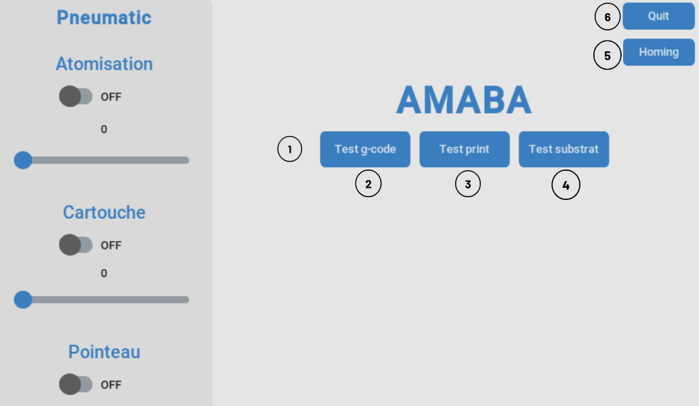
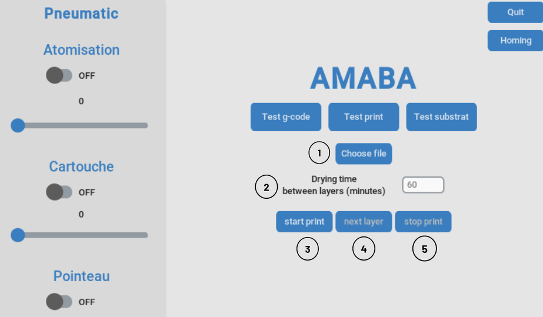
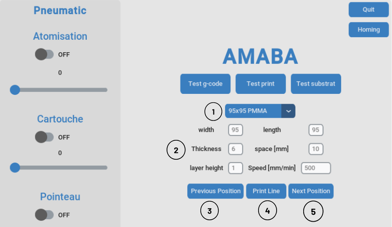
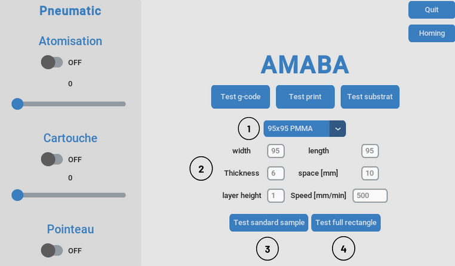

Usage
=====

.. _installation:

Installation
------------

To use AMABA, first make sure etherlabmaster is supported, a first test was made with a raspberry Pi 2b  and it wasn't successful. 
The installation was then made on the rapberry Pi 5 following the installation described here: https://embeng.dynv6.net/igh-ethercat-master-on-bbb-rpi
There is no need for a real time kerenl and the standard raspbian OS 64-bit was enough.

after installation the basic commands needed are :

.. code-block:: console

   sudo ethercatctl start

Then check if you can detect the slaves linked to the beckhoff coupler:

.. code-block:: console

   ethercat slaves

If yes then the installation worked and it's enough for the rest of the projet, otherwise try installing again the etherlabmaster repositories or change the hardware.

If it hasn't been done already git clone the project:

.. code-block:: console

   git clone https://github.com/42Hugo/amaba.git

You can then change the file main.c located in the example user of the etherlabmaster project to the one provided in the amaba project.

.. code-block:: console

   cd etherlabmaster/examples/user

Then you can compile the new version of main.c, the makefile is already provided in the standard etherlabmaster project and should make a file called ec_user_example.

.. code-block:: console

   sudo make

In pneumatic_control.py you have to change the directory of the ec_user_example file to the one you just compiled.

.. code-block:: python

   self.process = subprocess.Popen(['/home/amaba/Desktop/dev_ws/ighEthercat/ethercat/examples/user/ec_user_example'],  stdin=subprocess.PIPE)

depending on the usb port you're using you might have to change the port in the printer_control.py file:

.. code-block:: python

   self.serial = serial.Serial('/dev/ttyUSB0', 115200, timeout=1)

If you're using a raspberry Pi you'll have to create a python virtual environment to install the required packages(https://www.raspberrypi.com/documentation/computers/os.html#use-pip-with-virtual-environments) and it is usually recommened: 

.. code-block:: python

   pip install customtkinter # this is a custom tkinter version that is needed for the GUI
   pip install printrun # this is the package that will allow you to send gcode to the printer

and any other package that might be missing.

start the GUI by running the main.py file, the right python virtual environment should be activated:  

.. code-block:: console

   python main.py

The run_amaba.sh file will start a defined virtual environment and run the main.py file to start the GUI.

Using the GUI
----------------

.. note::

   if the Raspberry Pi crash and logs you out, the keyboard is set to qwerty when you need to write the password.

Connection to printer and pneumatic control
~~~~~~~~~~~~~~~~~~~~~~~~~~~~~~~~~~~~~~~~~~~~

1. Click on any printer menu to connect to the printer and perform a homing sequence
2. Test g-code to choose a g-code file and send it to the printer
3. Test print to print one line at a time and tests various parameters
4. Test substrat to print multiple lines on the whole substrat
5. Homing to perform a homing sequence 
6. Quit to close the GUI

The pneumatic controls on the left panel are opened at the start of the program. Each switch opens or closes a solenoid valve, and the pressure regulator is controlled by the slider.

Test g-code
~~~~~~~~~~~

1. Choose a gcode file to print by clicking on the button.
2. Set the drying time. The limit is set to 29 minutes because if there are no new instructions within 30 minutes, the printer will stop with the message "Heating disabled by safety timer."
3. Start the print with the set drying time and the chosen gcode file.
4. Instead of setting the drying time, you can manually start the next layer by clicking on the button.
5. Stop the print. It won't be possible to resume after stopping.

Test print 
~~~~~~~~~~~~

1. Choose predefined substrat parameters.
2. Specify the substrat parameters here if needed. The space entry is the distance between two printed lines, width is on the x-axis of the printer, and length is on the y-axis.
3. Move the nozzle to the front from the distance specified in "space" (negative movement on the y-axis).
4. Print a line at the current y position of the nozzle.
5. Move the nozzle to the back from the distance specified in "space" (positive movement on the y-axis).

Test substrat
~~~~~~~~~~~~~~~~

1. Choose predefined substrat parameters.
2. Specify the substrat parameters here if needed. The space entry is the distance between two printed lines, width is on the x-axis of the printer, and length is on the y-axis.
3. Start printing lines throughout the substrat.
4. Test a full rectangle print (not working well yet).

