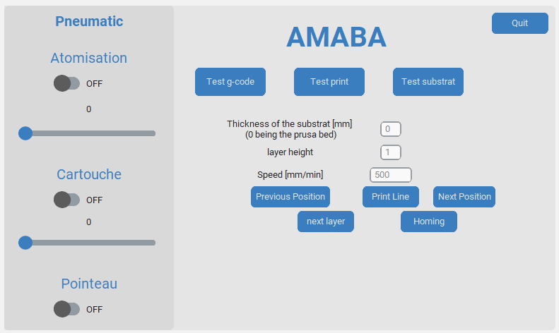

Usage
=====

.. _installation:

Installation
------------

To use AMABA, first make sure etherlabmaster is supported, a first test was made with a raspberry Pi 2b  and it wasn't working. 
The installation was then made on the rapberry Pi 5 following the installation described here:\n
There is no need for a real time kerenl and the standard raspbian OS 64-bit was enough.

after installation the basic commands needed are :

.. code-block:: console

   sudo ethercatctl start

Then check if you can detect the slaves linked to the beckhoff coupler:

.. code-block:: console

   ethercat slaves

If yes then the installation worked and it's enough for the rest of the projet, otherwise ty installing again the etherlabmaster repositories or change the hardware.

If it hasn't been done already git clone the project:

.. code-block:: console

   git clone https://github.com/42Hugo/amaba.git

You can then change the file main.c located in the example user of the etherlabmaster project to the one provided in the amaba project.

.. code-block:: console

   cd etherlabmaster/examples/user

Then you can compile the new version of main.c, the makefile is already provided in the standard etherlabmaster project and should make a file called ec_user_example.

.. code-block:: console

   sudo make

In pneumatic_control.py you have to change the directory of the ec_user_example file to the one you just compiled.

.. code-block:: python

   self.process = subprocess.Popen(['/home/amaba/Desktop/dev_ws/ighEthercat/ethercat/examples/user/ec_user_example'],  stdin=subprocess.PIPE)

If you're using a raspberry Pi you'll have to create a python virtual environment to install the required packages(https://www.raspberrypi.com/documentation/computers/os.html#use-pip-with-virtual-environments) and it is usually recommened: 

.. code-block:: python

   pip install customtkinter # this is a custom tkinter version that is needed for the GUI
   pip install printrun # this is the package that will allow you to send gcode to the printer

and any other package that might be missing.

start the GUI by running the main.py file:

.. code-block:: console

   python main.py

Using the GUI
----------------

Connection to ethercat and printer
~~~~~~~~~~~~~~~~~~~~~~~~~~~~~~~~~~

1. Click on connect to start the subprocess handling the ethercat communication
2. Click on any printer menu to connect to the printer and perform a homing sequence
3. Test g-code to choose a g-code file and send it to the printer
4. Test print to print one line at a time and tests various parameters
5. Test substrat to print multiple lines on the whole substrat
6. Homing to perform a homing sequence 
7. Quit to close the GUI

Pneumatic control
~~~~~~~~~~~~~~~~~

every swith opens or closes the solenoid valve and the pressure regulator is controlled by the slider.

Test g-code
~~~~~~~~~~~

Test print 
~~~~~~~~~~~~

Test substrat
~~~~~~~~~~~~~~~~

